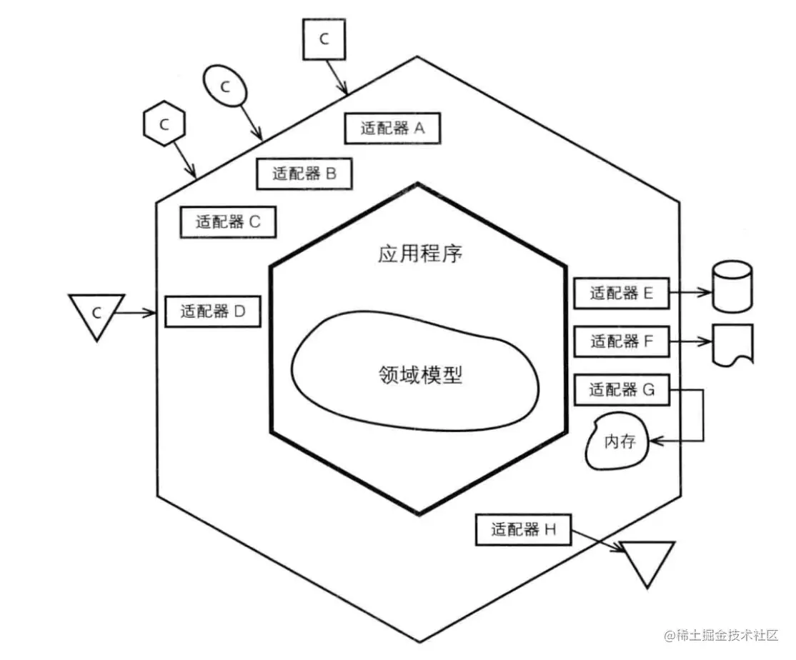

# 领域驱动设计
**常见的DDD实现架构有很多种，如经典四层架构、六边形（适配器端口）架构、整洁架构（Clean Architecture）、CQRS架构等。架构无优劣高下之分，只要熟练掌握就都是合适的架构。**

>>Domain层： 该层是DDD的核心，包含了领域对象、值对象、聚合根等，以及领域内的业务逻辑和规则。在领域内，业务逻辑应该尽量内聚，领域间应该尽量松耦合。
>
>>基础架构层： 包括仓储实现，缓存实现，队列实现等等系列系统需要的基础能力，这一层的目的是为整个项目提供基础支持。
>
>>Application层： 这一层用于组合领域内的服务，形成具体的应用用例。它不包含具体的业务逻辑，只是通过调用领域内的服务来实现具体的功能。
>
>>UI层： UI层负责展示数据和接收用户输入，它不包含业务逻辑，只是通过调用Application层来触发业务流程。
>
>[领域驱动设计(DDD): 三层架构到DDD架构演化](https://juejin.cn/post/7270393208776785960)

